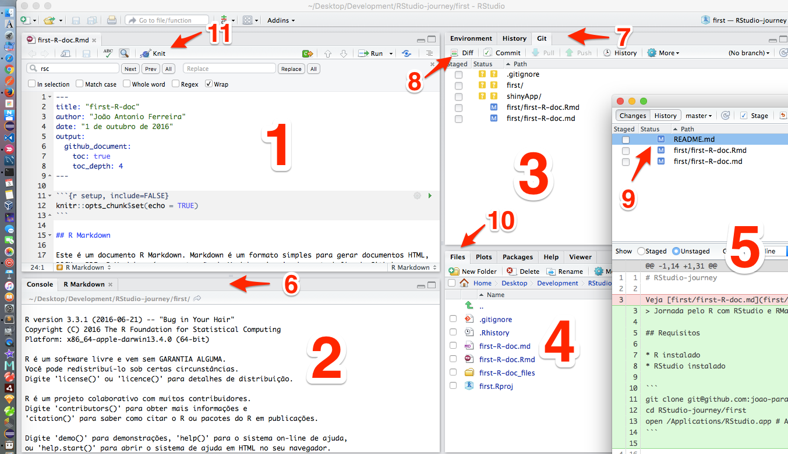

first-R-doc
================
João Antonio Ferreira
5 de outubro de 2016

-   [R Markdown](#r-markdown)
-   [Executando funções do R sobre DataSets](#executando-funcoes-do-r-sobre-datasets)
-   [Uma seção de exemplo no R](#uma-secao-de-exemplo-no-r)
    -   [Operador atribuição](#operador-atribuicao)
    -   [Comentários em R](#comentarios-em-r)
    -   [Solicitando Ajuda](#solicitando-ajuda)
    -   [Instalando um Pacote](#instalando-um-pacote)
    -   [Usando um pacote](#usando-um-pacote)
    -   [Listando DataSets instalados](#listando-datasets-instalados)
    -   [Usando um DataSet em particular](#usando-um-dataset-em-particular)
    -   [Inspecionando um DataSet](#inspecionando-um-dataset)
-   [A linguagem R](#a-linguagem-r)
    -   [Sequência de Inteiros](#sequencia-de-inteiros)
    -   [Objetos](#objetos)
    -   [Vetores](#vetores)
        -   [Concatenando valores para obter um vetor](#concatenando-valores-para-obter-um-vetor)
        -   [Concatenando valores com coersão de tipos implicita](#concatenando-valores-com-coersao-de-tipos-implicita)
        -   [Fazendo coersão de tipos de forma explicita](#fazendo-coersao-de-tipos-de-forma-explicita)
    -   [Listas](#listas)
-   [Usando o visNetwork - pacote R package para Visualização Interativa de Rede](#usando-o-visnetwork---pacote-r-package-para-visualizacao-interativa-de-rede)
-   [Aplicação WEB com R](#aplicacao-web-com-r)

R Markdown
----------

Este é um documento R Markdown. Markdown é um formato simples para gerar documentos HTML, DOCX e PDF. R-Markdown é uma extensão de Markdown inspirada no trabalho do Github que criou sua propria extensão do Markdown original para permitir uma documentação de projeto simplificada porém poderosa em termos de formatação para códigos fonte.

Para detalhes de Markdown veja: <https://daringfireball.net/projects/markdown/>

Para detalhes sobre as extensões do Github ao Markdown veja: [GitHub flavored Markdown](https://guides.github.com/features/mastering-markdown/#GitHub-flavored-markdown)

Mais detalhes sobre R-Markdown em <http://rmarkdown.rstudio.com>.

Para editar R-Markdown ou executar comandos R na console use a **IDE RStudio**.

A IDE RStudio é dividida em paineis. Veja figura abaixo:

 Figura 1 - RStudio IDE

Segue uma breve descrição sobre a imagem

1.  Painel de Edição do Documento RMarkdown
2.  Painel de Console e de Log
3.  Painel de Ambiente History e Git
4.  Painel para mostrar arquivos, renderizar gráficos, listar pacotes, mostrar Ajuda e Visualizar objetos
5.  Janela adicional para detalhes do controle de versão no Git
6.  Área clicavel de seleção entre Console R e Paienl de Log
7.  Área clicavel de seleção entre Ambiente, Histórico e Git
8.  Área clicavel de seleção entre dif, commit e outros comandos `git`
9.  Click para selecionar arquivos a serem processados pelos comandos `git`
10. Área clicavel de seleção entre arquivos, gráficos, pacotes, etc.
11. Botão **Knit** para inicio do parser RMarkdown

Clicando no botão **Knit** será gerado um documento HTML contendo o texto formatado além dos resultados dos comandos R presentes no documento que são dinâmicamente avaliados.

A anotação markdown que permite executar comandos R é essa mostrada no exemplo abaixo:

**\`\`\`{r, echo=TRUE, eval=TRUE}**

`echo` define se o R-Studio deve echoar no documento de saida (TRUE) ou não (FALSE)

`eval` define se o R-Studio deve avaliar os comandos R (TRUE) ou não (FALSE)

Ou seja, não faz sentido usar a combinação FALSE, FALSE, porém as outras combinações são úteis.

Após colocar os comandos R desejados, a anotação citada acima deve terminar com

**\`\`\`**

O documento HTML é criado em área temporária e podemos abrir no Browser. As imagens e códigos CSS ficam codificados inline no HTML eliminando a necessidade de arquivos externos.

Exemplo de HTML gerado na área temporária:

``` html
<!DOCTYPE html>
<html xmlns="http://www.w3.org/1999/xhtml">
  <head>
    <meta charset="utf-8">
    <meta http-equiv="Content-Type" content="text/html; charset=utf-8" />
    <meta name="generator" content="pandoc" />
    <meta name="viewport" content="width=device-width, initial-scale=1">
    <link href="data:text/css;charset=utf-8,%0A%40font%2Dface%20%7B%0Afont%2Dfamily%3A%20octicons%2Dlink%3B%0Asrc%3A%20. . . " rel="stylesheet">
    <style>
      body {
        box-sizing: border-box;
        min-width: 200px;
        max-width: 980px;
        margin: 0 auto;
        padding: 45px;
        padding-top: 0px;
      }
    </style>
  </head>
  <body>
    <h1 id="first-r-doc">first-R-doc</h1>
    <p>João Antonio Ferreira<br />1 de outubro de 2016</p>
    <ul>
      . . .  <!-- Aqui entra o conteúdo renderizado para HTML -->
    </ul>
  </body>
```

Uma ultima obseravação é sobre o suporte a **Emoji**. Você pode usar códigos como `:smile:` para exibir :smile: ou `:+1:` para exibir :+1:, etc.

A lista de códigos Emoji pode ser vista neste site: [http://www.webpagefx.com/tools/emoji-cheat-sheet](http://www.webpagefx.com/tools/emoji-cheat-sheet/)

Uma documentação completa sobre **R-Markdown** pode ser encontrada na WEB. Por exemplo, no endereço abaixo podemos ver a documentação sobre o atributo `output` do R-Markdown com valor `github_document`.

<http://rmarkdown.rstudio.com/github_document_format.html>

Ok, agora que temos uma visão geral sobre a IDE, que tal usá-la para entender um pouco da dinâmica do R. No R os DataSets tem papel fundamental.

Executando funções do R sobre DataSets
--------------------------------------

Obtendo um resumo do DataSet. No exemplo abaixo inspecionamos resumidamente o Dataset `cars` instalado por Default no ambiente R

``` r
summary(cars)
```

    ##      speed           dist       
    ##  Min.   : 4.0   Min.   :  2.00  
    ##  1st Qu.:12.0   1st Qu.: 26.00  
    ##  Median :15.0   Median : 36.00  
    ##  Mean   :15.4   Mean   : 42.98  
    ##  3rd Qu.:19.0   3rd Qu.: 56.00  
    ##  Max.   :25.0   Max.   :120.00

Incluindo gráficos no documento de saida com R-Markdown

Você pode incluir gráficos como no exemplo abaixo onde desenhamos o Dataset `pressure` instalado por Default no ambiente R:


Observe o parâmetro `echo = FALSE` que previne da impressão (na saida) da linha de comando R que gerou o gráfico. Isso foi explicado na seção anterior

Uma seção de exemplo no R
-------------------------

Antes de começar vamos listar algumas URL úteis:

-   Stack Exchange para métodos numéricos em Estatística <http://stats.stackexchange.com/questions/tagged/r>

### Operador atribuição

``` r
x <- 3.1416
print(x)
```

    ## [1] 3.1416

``` r
x
```

    ## [1] 3.1416

O `[1]` indica que `x` é um vetor e que `3.1416` é seu valor.

Outro exemplo:

``` r
msg <- "alô mundo !"
```

### Comentários em R

Podemos comentar o código R

``` r
# aqui entra comentário.
```

### Solicitando Ajuda

Podemos solicitar Help de um comando. Nesta caso uma pagina HTML será renderizada no painel Help (Normalmente embaixo à direita).

Suponha que desejemos usar o pacote `arules` e nem saibamos por onde começar. Podemos começar assim:

``` r
help("install.packages")
```

### Instalando um Pacote

Então podemos instalar o pacote assim:

``` r
# Execute install.packages("devtools") na console do RStudio
# Execute install.packages("arules") na console do RStudio
```

### Usando um pacote

Após a instalação podemos usá-lo

``` r
library("arules")
```

    ## Loading required package: Matrix

    ## 
    ## Attaching package: 'arules'

    ## The following objects are masked from 'package:base':
    ## 
    ##     abbreviate, write

Que tal verificar como funciona a funcão que lida com DataSetes

``` r
help("data")
```

### Listando DataSets instalados

Podemos listar todos os datasets instalados

``` r
data()
```

Ou podemos listar os datasets instalados apenas com o pacote `arules`, por exemplo

``` r
try(data(package = "arules") )
```

### Usando um DataSet em particular

OK, então podemos usar um dos datasets listados

``` r
ds <- c("Adult")
data(list = ds)
```

Agora podemos inspecionar o dataset Adult verificando sua dimensão (linhas e colunas)

``` r
dim(Adult)
```

    ## [1] 48842   115

### Inspecionando um DataSet

Ou podemos inspecionar o dataset Adult vendo todo o resumo

``` r
summary(Adult)
```

    ## transactions as itemMatrix in sparse format with
    ##  48842 rows (elements/itemsets/transactions) and
    ##  115 columns (items) and a density of 0.1089939 
    ## 
    ## most frequent items:
    ##            capital-loss=None            capital-gain=None 
    ##                        46560                        44807 
    ## native-country=United-States                   race=White 
    ##                        43832                        41762 
    ##            workclass=Private                      (Other) 
    ##                        33906                       401333 
    ## 
    ## element (itemset/transaction) length distribution:
    ## sizes
    ##     9    10    11    12    13 
    ##    19   971  2067 15623 30162 
    ## 
    ##    Min. 1st Qu.  Median    Mean 3rd Qu.    Max. 
    ##    9.00   12.00   13.00   12.53   13.00   13.00 
    ## 
    ## includes extended item information - examples:
    ##            labels variables      levels
    ## 1       age=Young       age       Young
    ## 2 age=Middle-aged       age Middle-aged
    ## 3      age=Senior       age      Senior
    ## 
    ## includes extended transaction information - examples:
    ##   transactionID
    ## 1             1
    ## 2             2
    ## 3             3

Observe acima as métricas e resumos estatísticos sobre este dataset

    48842 linhas
      115 colunas
    ...
    ítens mais frequentes (valores discretos e seu quantitativo de ocorrências), etc.

Podemos executar uma função `eclat` sobre o dataset

``` r
e <- eclat(Adult)
```

    ## Eclat
    ## 
    ## parameter specification:
    ##  tidLists support minlen maxlen            target   ext
    ##     FALSE     0.1      1     10 frequent itemsets FALSE
    ## 
    ## algorithmic control:
    ##  sparse sort verbose
    ##       7   -2    TRUE
    ## 
    ## Absolute minimum support count: 4884 
    ## 
    ## create itemset ... 
    ## set transactions ...[115 item(s), 48842 transaction(s)] done [0.03s].
    ## sorting and recoding items ... [31 item(s)] done [0.01s].
    ## creating bit matrix ... [31 row(s), 48842 column(s)] done [0.01s].
    ## writing  ... [2616 set(s)] done [0.01s].
    ## Creating S4 object  ... done [0.00s].

E ver o resumo

``` r
summary(e)
```

    ## set of 2616 itemsets
    ## 
    ## most frequent items:
    ##            capital-loss=None            capital-gain=None 
    ##                         1255                         1220 
    ## native-country=United-States                   race=White 
    ##                         1213                         1169 
    ##                     sex=Male                      (Other) 
    ##                          932                         5459 
    ## 
    ## element (itemset/transaction) length distribution:sizes
    ##   1   2   3   4   5   6   7   8   9 
    ##  31 185 504 757 666 352 104  16   1 
    ## 
    ##    Min. 1st Qu.  Median    Mean 3rd Qu.    Max. 
    ##     1.0     3.0     4.0     4.3     5.0     9.0 
    ## 
    ## summary of quality measures:
    ##     support      
    ##  Min.   :0.1000  
    ##  1st Qu.:0.1168  
    ##  Median :0.1390  
    ##  Mean   :0.1762  
    ##  3rd Qu.:0.1956  
    ##  Max.   :0.9533  
    ## 
    ## includes transaction ID lists: FALSE 
    ## 
    ## mining info:
    ##   data ntransactions support
    ##  Adult         48842     0.1

Ou inspecionar os detalhes

``` r
inspect(e)
```

Nesta inspeção vemos que a saida é muito grande e praticamente inutil para uma sessão interativa. Então vamos pegar apenas os *top five* considerando o atributo `support`

``` r
s <- sort(e)
```

``` r
p <- s[1:5]
inspect(p)
```

    ##      items                                 support  
    ## 2586 {capital-loss=None}                   0.9532779
    ## 2587 {capital-gain=None}                   0.9173867
    ## 2588 {native-country=United-States}        0.8974243
    ## 2585 {capital-gain=None,capital-loss=None} 0.8706646
    ## 2589 {race=White}                          0.8550428

Agora que já brincamos um pouco com os DataSets na console do R vamos entrar mais a fundo na Linguagem em sí.

A linguagem R
-------------

Já falamos de **atribuição** e de **comentários** na seção anterior. Falaremos agora das outras funcionalidades e caracteristicas da Linguagem R.

### Sequência de Inteiros

Sequencias são vetores, portanto são objetos e possuem atributo classe

``` r
x <- 3:27
x
```

    ##  [1]  3  4  5  6  7  8  9 10 11 12 13 14 15 16 17 18 19 20 21 22 23 24 25
    ## [24] 26 27

``` r
y <- 1:10
y
```

    ##  [1]  1  2  3  4  5  6  7  8  9 10

``` r
class(y)
```

    ## [1] "integer"

Parece obvio que não funcionaria com números Reais, certo ? Veja o resultado.

``` r
x <- 3.14:4.72
x
```

    ## [1] 3.14 4.14

``` r
class(x)
```

    ## [1] "numeric"

O R gera apenas os dois elementos da extremidade

A politica da linguagem é sempre gerar alguma coisa, **evitando lançar exceção**.

### Objetos

Tipos básicos (atômicos)

-   character
-   numeric
-   integer
-   complex
-   logical

vector é um Basic Object

vector e list podem conter objetos dentro deles.

Use a função vector() para criar vetores.

O Objeto Number pode assumir os valores Inf e NaN

Objetos podem ter atributos

Ex: names, dimnames, class, length e outros atributos definidos pelo usuário.

Existem vários tipos **não básicos** definidos no core da linguagem. Isso inclui Date, data.frame, etc. Programadores podem criar seus proprios tipos também.

### Vetores

#### Concatenando valores para obter um vetor

-   Números reais (numeric)

``` r
x <- c(0.5, 0.6, 10.01, 1.0, -3.0)
x
```

    ## [1]  0.50  0.60 10.01  1.00 -3.00

``` r
class(x)
```

    ## [1] "numeric"

-   Números inteiros (integer)

``` r
x <- c(5, 6, 10, 1, -3)
x
```

    ## [1]  5  6 10  1 -3

``` r
class(x)
```

    ## [1] "numeric"

**Atenção: ** Diferentemente da sequência de inteiros, na concatenação de valores inteiros eles são tratados como numeric. Veja este comportamento anômalo no exemplo acima.

-   Valores lógicos

``` r
x <- c(TRUE, T, T, F, T, FALSE)
x
```

    ## [1]  TRUE  TRUE  TRUE FALSE  TRUE FALSE

``` r
class(x)
```

    ## [1] "logical"

-   Valores tipo caracter

``` r
x <- c("TRUE", "Pi vale 3.1416", "Ok, batata frita", "Discordo", "Fora Temer !")
x
```

    ## [1] "TRUE"             "Pi vale 3.1416"   "Ok, batata frita"
    ## [4] "Discordo"         "Fora Temer !"

``` r
class(x)
```

    ## [1] "character"

-   Numeros complexos

``` r
x <- c(2+0i, 3+14i, -2+6i, 2-6i)
x
```

    ## [1]  2+ 0i  3+14i -2+ 6i  2- 6i

``` r
class(x)
```

    ## [1] "complex"

#### Concatenando valores com coersão de tipos implicita

-   de inteiro para real (numeric)

``` r
x <- c(0.5, 0.6, 2.17, 3.1416, 7.0) # coersão implicita de tipo
x
```

    ## [1] 0.5000 0.6000 2.1700 3.1416 7.0000

``` r
class(x)
```

    ## [1] "numeric"

-   de real (numeric) para caracter

``` r
y <- c(3.1416, "pi") # coersão implicita de tipo
y
```

    ## [1] "3.1416" "pi"

``` r
class(y)
```

    ## [1] "character"

-   de lógico para real (numeric)

``` r
z <- c(TRUE, 2.3)    # coersão implicita de tipo
z
```

    ## [1] 1.0 2.3

``` r
class(z)
```

    ## [1] "numeric"

-   de lógico para caracter

``` r
z <- c(TRUE, "2.3")    # coersão implicita de tipo
z
```

    ## [1] "TRUE" "2.3"

-   de logico para inteiro

``` r
y <- c(TRUE, FALSE, 0 , 1) # coersão implicita de tipo
y
```

    ## [1] 1 0 0 1

``` r
class(y)
```

    ## [1] "numeric"

-   de inteiro para complexo

``` r
y <- c(3, 1+0i) # coersão implicita de tipo
y
```

    ## [1] 3+0i 1+0i

``` r
class(y)
```

    ## [1] "complex"

#### Fazendo coersão de tipos de forma explicita

-   de lógico para inteiro

dado um vetor `b` de booleanos (logical), temos:

``` r
b
```

    ## [1]  TRUE  TRUE FALSE  TRUE

``` r
x <- as.integer(b)
x
```

    ## [1] 1 1 0 1

-   para real, logico, complexo, character e lógico

dado um vetor `a` de inteiros

``` r
a <- (-3):5
a
```

    ## [1] -3 -2 -1  0  1  2  3  4  5

``` r
class(a)
```

    ## [1] "integer"

temos:

``` r
x <- as.numeric(a)
x
```

    ## [1] -3 -2 -1  0  1  2  3  4  5

``` r
x <- as.logical(a)
x
```

    ## [1]  TRUE  TRUE  TRUE FALSE  TRUE  TRUE  TRUE  TRUE  TRUE

``` r
x <- as.complex(a)
x
```

    ## [1] -3+0i -2+0i -1+0i  0+0i  1+0i  2+0i  3+0i  4+0i  5+0i

``` r
x <- as.character(a)
x
```

    ## [1] "-3" "-2" "-1" "0"  "1"  "2"  "3"  "4"  "5"

``` r
x <- as.logical(a)
x
```

    ## [1]  TRUE  TRUE  TRUE FALSE  TRUE  TRUE  TRUE  TRUE  TRUE

A função `as` também pode ser definida para **tipo não básico**, como mostrado no exemplo abaixo:

-   de character para Date (um tipo não básico)

dado um vetor `a` de carateres representando datas

``` r
a <- c("2016-09-28", "2016-09-29", "2016-09-30", "2016-09-31")
a
```

    ## [1] "2016-09-28" "2016-09-29" "2016-09-30" "2016-09-31"

temos:

``` r
x <- as.Date(a)
x
```

    ## [1] "2016-09-28" "2016-09-29" "2016-09-30" NA

Outro exemplo de **tipo não básico**:

``` r
a <- (-3):5
x <- as.data.frame(a)
x
```

    ##    a
    ## 1 -3
    ## 2 -2
    ## 3 -1
    ## 4  0
    ## 5  1
    ## 6  2
    ## 7  3
    ## 8  4
    ## 9  5

Situações em que a coersão explicita de tipo **gera Erro**

``` r
a <- c("2016-09-28", "2016-09", "2016", "31", "PI", "π")
x <- as.numeric(a)
```

    ## Warning: NAs introduzidos por coerção

``` r
x
```

    ## [1]   NA   NA 2016   31   NA   NA

``` r
x <- as.complex(a)
```

    ## Warning: NAs introduzidos por coerção

``` r
x
```

    ## [1]      NA      NA 2016+0i   31+0i      NA      NA

Mesmo a, b, c sendo digitos Hexadecimais

``` r
a <- c("a", "b", "c")
a
```

    ## [1] "a" "b" "c"

temos:

``` r
x <- as.numeric(a)
```

    ## Warning: NAs introduzidos por coerção

``` r
x
```

    ## [1] NA NA NA

``` r
x <- as.logical(a)
x
```

    ## [1] NA NA NA

``` r
x <- as.complex(a)
```

    ## Warning: NAs introduzidos por coerção

``` r
x
```

    ## [1] NA NA NA

``` r
x <- x
```

### Listas

Listas são tipos especiais de vetores que aceitam objetos de qualquer tipo e não fazem nenhuma coerção implicita de tipo. Além de objetos dos tipos básicos, as listas aceitam também sequencias de inteiros, vetores e outras listas como seus elementos. Isso permite criar grafos arbitrários de objetos. Veja um exemplo abaixo:

``` r
a <- list("a", "b", TRUE, 3.14, 0-5i, -2:3, c("Fora Temer !", "Concordo"), list("π", "∑ µ", "ß"))
a
```

    ## [[1]]
    ## [1] "a"
    ## 
    ## [[2]]
    ## [1] "b"
    ## 
    ## [[3]]
    ## [1] TRUE
    ## 
    ## [[4]]
    ## [1] 3.14
    ## 
    ## [[5]]
    ## [1] 0-5i
    ## 
    ## [[6]]
    ## [1] -2 -1  0  1  2  3
    ## 
    ## [[7]]
    ## [1] "Fora Temer !" "Concordo"    
    ## 
    ## [[8]]
    ## [[8]][[1]]
    ## [1] "π"
    ## 
    ## [[8]][[2]]
    ## [1] "∑ µ"
    ## 
    ## [[8]][[3]]
    ## [1] "ß"

Observe o display acima para inferir a estrutura do Grafo de objetos.

Usando o visNetwork - pacote R package para Visualização Interativa de Rede
---------------------------------------------------------------------------

``` r
# Execute install.packages("visNetwork") na console do RStudio
require(visNetwork, quietly = TRUE)
nodes <- data.frame(id = 1:10,
  # add labels on nodes
  label = paste("Node", 1:10),
  # add groups on nodes 
  group = c("GrA", "GrB"),
  # size adding value
  value = 1:10,          
  # control shape of nodes
  shape = c("square", "triangle", "box", "circle", "dot", "star",
  "ellipse", "database", "text", "diamond"),
  # tooltip (html or character), when the mouse is above
  title = paste0("<p><b>", 1:10, "</b><br>Node !</p>"),
  # color
  color = c("darkred", "grey", "orange", "darkblue", "purple"),
  # shadow
  shadow = c(FALSE, TRUE, FALSE, TRUE, TRUE)
)
edges <- data.frame(from = c(1,2,5,7,8,10), to = c(9,3,1,6,4,7))
```

``` r
# Execute o comando abaixo na Console do RStudio
visNetwork(nodes, edges, height = "500px", width = "100%")
```

``` r
nodes <- data.frame(id = 1:3, 
                    color.background = c("red", "blue", "green"),
                    color.highlight.background = c("red", NA, "red"), 
                    shadow.size = c(5, 10, 15))
edges <- data.frame(from = c(1,2), to = c(1,3),
                    label = LETTERS[1:2], 
                    font.color =c ("red", "blue"), 
                    font.size = c(10,20))
```

``` r
# Execute o comando abaixo na Console do RStudio
visNetwork(nodes, edges)
```

Detalhes sobre o `visNetwork` podem ser vistas no site <http://datastorm-open.github.io/visNetwork/>

Aplicação WEB com R
-------------------

Que tal integrar com o <https://www.shinyapps.io> ?

Fácil ! Instale o pacote `rsconnect`

``` r
# Execute install.packages("rsconnect")
```

Crie uma conta tipo **Free** usando seu e-mail preferido e entre no Dashboard <https://www.shinyapps.io/admin/#/dashboard>

``` r
# Execute install.packages("webshot")
#
# Read R file with token and secret 
source("../token_and_secret.R")
library(rsconnect)
rsconnect::setAccountInfo(
        name='joao-parana',
              token=token,
              secret=secret)
```

**OBS:** *Crie sua propria conta e atualize seus dados de credenciais: **name**, **token** e **secret***

Veja o texto abaixo retirado da página e Ajuda do RStudio.

**Using your R packages in the cloud**

In order to run your applications on shinyapps.io, the service needs to replicate the environment from your local machine. shinyapps.io is built using **Ubuntu Linux** as the base operating system, and is likely to be different from most users’ systems.

Veja exemplo de aplicação Shiny

``` r
require(shiny)
```

    ## Loading required package: shiny

    ## 
    ## Attaching package: 'shiny'

    ## The following object is masked from 'package:rsconnect':
    ## 
    ##     serverInfo

``` r
require(visNetwork)

server <- function(input, output) {
  output$network <- renderVisNetwork({
    # minimal example
    nodes <- data.frame(id = 1:3)
    edges <- data.frame(from = c(1,2), to = c(1,3))
    
    visNetwork(nodes, edges)
  })
}

ui <- fluidPage(
    visNetworkOutput("network")
)
```

``` r
# shinyApp(ui = ui, server = server)
```

``` r
# library(shiny)
server = function(input, output) {
  output$distPlot <- renderPlot({
    # generate bins based on input$bins from ui.R
    x    <- faithful[, 2]
    bins <- seq(min(x), max(x), length.out = input$bins + 1)
    # draw the histogram with the specified number of bins
    hist(x, breaks = bins, col = 'darkgray', border = 'white')
  })
}

ui <- shinyUI(fluidPage(

  # Application title
  titlePanel("Old Faithful Geyser Data"),
  # Sidebar with a slider input for number of bins
  sidebarLayout(
    sidebarPanel(
      sliderInput("bins",
                  "Number of bins:",
                  min = 1,
                  max = 50,
                  value = 30)
    ),
    # Show a plot of the generated distribution
    mainPanel(
      plotOutput("distPlot")
    )
  )
))

# shinyApp(ui = ui, server = server)
```

Considere agora o caso de publicar uma aplicação em `https://sua-conta.shinyapps.io`.

Veja onde está o diretório corrente

``` r
getwd()
```

    ## [1] "/Users/admin/Desktop/Development/RStudio-journey/first"

Crie o diretório `../shinyApp/app01` e coloque lá os dois arquivos abaixo, caso não existam:

server.R

``` r
library(shiny)

shinyServer(function(input, output) {
  output$distPlot <- renderPlot({
    # generate bins based on input$bins from ui.R
    x    <- faithful[, 2]
    bins <- seq(min(x), max(x), length.out = input$bins + 1)
    # draw the histogram with the specified number of bins
    hist(x, breaks = bins, col = 'darkgray', border = 'white')
  })
})
```

ui.R

``` r
shinyUI(fluidPage(

  # Application title
  titlePanel("Old Faithful Geyser Data"),
  # Sidebar with a slider input for number of bins
  sidebarLayout(
    sidebarPanel(
      sliderInput("bins",
                  "Number of bins:",
                  min = 1,
                  max = 50,
                  value = 30)
    ),
    # Show a plot of the generated distribution
    mainPanel(
      plotOutput("distPlot")
    )
  )
))
```

Agora faça a implantação no hosting de aplicações R **shinyapps.io**

``` r
# Execute o comando abaixo na console do R
rsconnect::deployApp('../shinyApp/app01')
```

O comando rsconnect abre automaticamente o Browser na página, que no meu caso é : <https://joao-parana.shinyapps.io/app01/>
