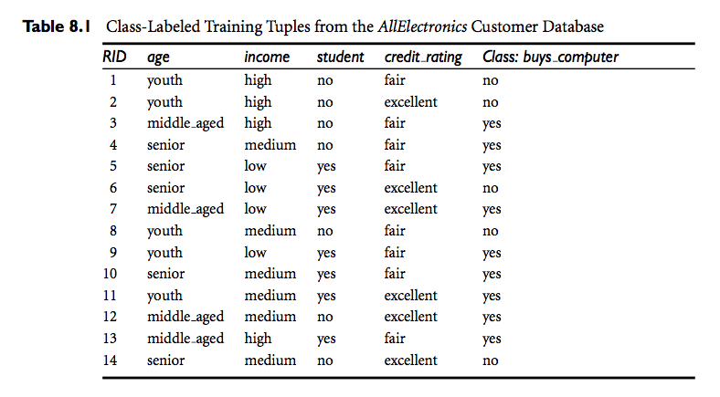

Trabalho de Mineração de Dados
================
João Antonio Ferreira
13 de dezembro de 2016

-   [Enunciado do problema:](#enunciado-do-problema)
-   [Decrição da Solução](#decricao-da-solucao)
    -   [Programa em linguagem R](#programa-em-linguagem-r)
-   [R Markdown](#r-markdown)

Enunciado do problema:
----------------------

> **Os alunos deverão entregar o trabalho de classificação, produzindo uma função em R com a implementação do Naive Bayes. Usar o Dataset `dataset_han_classificacao.csv`**

O conteúdo do arquivo `dataset_han_classificacao.csv` fornecido é :

``` csv
ID,Idade,Renda,Estudante,ClassifCredito,Classe
1,1,1,2,1,N
2,1,1,2,2,N
3,2,1,2,1,S
4,3,2,2,1,S
5,3,3,1,1,S
6,3,3,1,2,N
7,2,3,1,2,S
8,1,2,2,1,N
9,1,3,1,1,S
10,3,2,1,1,S
11,1,2,1,2,S
12,2,2,2,2,S
13,2,1,1,1,S
14,3,2,2,2,N
```

Este Dataset é uma mapeamento para inteiros dos atributos do exemplo do livro Data Mining Concepts and Techniques - 3º edição (página 338 - tabela 8.1).



Por exemplo, considerando o atributo Idade/age, temos que

1.  youth
2.  middle\_aged
3.  senior

e assim por diante.

Decrição da Solução
-------------------

O método de classificação **Naïve Bayes** é um método estatístico envolvendo contagens de instâncias e calculo de probabilidade. Desta forma usarei uma abordagem que favoreça o uso de funções que processem agregação, tal como sum(). Para isso o Dataset deve ser transformado numa etapa de pré-processamento. O algoritmo proposto aqui considera que os valores dos atributos são categorizados em intervalos (três níveis de idade, três níveis de renda, etc.). Uma maneira de simplificar a complexidade do algoritimo é realizar o mapeamento dos atributos para a forma binária.

Podemos fazer o mapeamento simples criando-se um novo atributo binário para cada valor do atributo em questão. Se houvesse atributos contínuos, teríamos que discretizá-los antes do mapeamento. Veja abaixo como fica o mapeamento para a tabela binária.

Resultado final: `dataset_binario.csv`

    id,a_youth,a_middle,a_senior,i_high,i_medium,i_low,s_yes,s_no,c_far,c_excellent,buy_no,buy_yes
    01,  1,0,0,  1,0,0,  0,1,  1,0,  1,0
    02,  1,0,0,  1,0,0,  0,1,  0,1,  1,0
    03,  0,1,0,  1,0,0,  0,1,  1,0,  0,1
    04,  0,0,1,  0,1,0,  0,1,  1,0,  0,1
    05,  0,0,1,  0,0,1,  1,0,  1,0,  0,1
    06,  0,0,1,  0,0,1,  1,0,  0,1,  1,0
    07,  0,1,0,  0,0,1,  1,0,  0,1,  0,1
    08,  1,0,0,  0,1,0,  0,1,  1,0,  1,0
    09,  1,0,0,  0,0,1,  1,0,  1,0,  0,1
    10,  0,0,1,  0,1,0,  1,0,  1,0,  0,1
    11,  1,0,0,  0,1,0,  1,0,  0,1,  0,1
    12,  0,1,0,  0,1,0,  0,1,  0,1,  0,1
    13,  0,1,0,  1,0,0,  1,0,  1,0,  0,1
    14,  0,0,1,  0,1,0,  0,1,  0,1,  1,0

Os espaços em branco foram colocados aqui apenas para separar os atributos visualmente.

Os novos nomes de atributos são:

-   a\_youth
-   a\_middle
-   a\_senior
-   i\_high
-   i\_medium
-   i\_low
-   s\_yes
-   s\_no
-   c\_far
-   c\_excellent
-   buy\_no
-   buy\_yes

onde os prefixos significam : a\_ -&gt; age, i\_ -&gt; income, s\_ -&gt; student, c\_ -&gt; credit\_rating

### Programa em linguagem R

Para **prever** a classe de uma **tupla X** devemos calcular a probabilidade máxima para cada instância da classe. Neste caso nossa Classe é `buys_computer` e as instâncias são `yes` (S) e `no` (N).

Usarei o dataset `dataset_binario.csv` como nosso **Conjunto de Tuplas para Treinamento**. Assim, dado uma tupla **X** poderemos determinar sua classe.

Obs: usarei o namespace `app` representando minha aplicação.

``` r
# Lendo o Dataset Transformado (dataset_binario.csv)
app.custumers <- read.table(file="dataset_binario.csv", header = T, row.names = 1, sep = ",")
```

``` r
print(app.custumers)
```

    ## ID a_youth a_middle a_senior i_high i_medium i_low s_yes s_no c_far c_excellent buy_no buy_yes
    ## 1        1        0        0      1        0     0     0    1     1           0      1       0
    ## 2        1        0        0      1        0     0     0    1     0           1      1       0
    ## 3        0        1        0      1        0     0     0    1     1           0      0       1
    ## 4        0        0        1      0        1     0     0    1     1           0      0       1
    ## 5        0        0        1      0        0     1     1    0     1           0      0       1
    ## 6        0        0        1      0        0     1     1    0     0           1      1       0
    ## 7        0        1        0      0        0     1     1    0     0           1      0       1
    ## 8        1        0        0      0        1     0     0    1     1           0      1       0
    ## 9        1        0        0      0        0     1     1    0     1           0      0       1
    ## 10       0        0        1      0        1     0     1    0     1           0      0       1
    ## 11       1        0        0      0        1     0     1    0     0           1      0       1
    ## 12       0        1        0      0        1     0     0    1     0           1      0       1
    ## 13       0        1        0      1        0     0     1    0     1           0      0       1
    ## 14       0        0        1      0        1     0     0    1     0           1      1       0 

``` r
# Obtendo o total de registros (tuplas)
app.buy_no_qty <- sum(app.custumers[,11])
app.buy_yes_qty <- sum(app.custumers[,12])
app.total_qty <- app.buy_no_qty + app.buy_yes_qty
print(paste('A quantidade total de tuplas é ', app.total_qty))
```

    ## [1] "A quantidade total de tuplas é  14"

``` r
app.all_names = names(app.custumers)
app.attributes = app.all_names[1:10]
print(paste('nome do atributo = ', app.attributes))
```

    ##  [1] "nome do atributo =  a_youth"     "nome do atributo =  a_middle"   
    ##  [3] "nome do atributo =  a_senior"    "nome do atributo =  i_high"     
    ##  [5] "nome do atributo =  i_medium"    "nome do atributo =  i_low"      
    ##  [7] "nome do atributo =  s_yes"       "nome do atributo =  s_no"       
    ##  [9] "nome do atributo =  c_far"       "nome do atributo =  c_excellent"

``` r
app.init_vector = c(0, 0, 0, 0, 0, 0, 0, 0, 0, 0)
app.probabilities = app.init_vector
names(app.probabilities) = app.attributes
app.probabilities.buy.equal.no = app.init_vector
app.probabilities.buy.equal.yes = app.init_vector

print('• • • • • • • • •  Probabilidades individuais de cada atributo    • • • • • • • • •')
```

    ## [1] "• • • • • • • • •  Probabilidades individuais de cada atributo    • • • • • • • • •"

``` r
for (attr in app.attributes) { 
  n <- (paste('attr = ', attr))
  v <- (paste(app.custumers[,attr]))
  # print para Debug
  # print(n)
  # print(v)
  # print(app.custumers[,attr])
  # print(app.custumers[,'buy_no'])
  app.p_attr_no = app.custumers[,attr] * app.custumers[,'buy_no']
  app.p_attr_yes = app.custumers[,attr] * app.custumers[,'buy_yes']
  app.probabilities.buy.equal.no[attr] <- sum(app.p_attr_no) / app.buy_no_qty
  app.probabilities.buy.equal.yes[attr] <- sum(app.p_attr_yes) / app.buy_yes_qty
  if(app.probabilities.buy.equal.yes[attr] > 0) {
    msg <- sprintf("P(%s | buy_computer = yes)  : %.3f", 
                   attr, app.probabilities.buy.equal.yes[attr])
    print(msg)
  }
  if(app.probabilities.buy.equal.no[attr] > 0) {
    msg <- sprintf("P(%s | buy_computer = no)  : %.3f", 
                   attr, app.probabilities.buy.equal.no[attr])
    print(msg)
  }
}
```

    ## [1] "P(a_youth | buy_computer = yes)  : 0.222"
    ## [1] "P(a_youth | buy_computer = no)  : 0.600"
    ## [1] "P(a_middle | buy_computer = yes)  : 0.444"
    ## [1] "P(a_senior | buy_computer = yes)  : 0.333"
    ## [1] "P(a_senior | buy_computer = no)  : 0.400"
    ## [1] "P(i_high | buy_computer = yes)  : 0.222"
    ## [1] "P(i_high | buy_computer = no)  : 0.400"
    ## [1] "P(i_medium | buy_computer = yes)  : 0.444"
    ## [1] "P(i_medium | buy_computer = no)  : 0.400"
    ## [1] "P(i_low | buy_computer = yes)  : 0.333"
    ## [1] "P(i_low | buy_computer = no)  : 0.200"
    ## [1] "P(s_yes | buy_computer = yes)  : 0.667"
    ## [1] "P(s_yes | buy_computer = no)  : 0.200"
    ## [1] "P(s_no | buy_computer = yes)  : 0.333"
    ## [1] "P(s_no | buy_computer = no)  : 0.800"
    ## [1] "P(c_far | buy_computer = yes)  : 0.667"
    ## [1] "P(c_far | buy_computer = no)  : 0.400"
    ## [1] "P(c_excellent | buy_computer = yes)  : 0.333"
    ## [1] "P(c_excellent | buy_computer = no)  : 0.600"

Com as probabilidades individuais calculadas podemos combinar atributos multiplicando as probabilidades correspondentes.

Tomemos como exemplo o problema do livro (Example 8.4).

> Predicting a class label using naïve Bayesian classification. We wish to predict the class label of a tuple using naïve Bayesian classification, given the same training data. The training data were shown earlier in Table 8.1. The data tuples are described by the attributes age, income, student, and credit rating. The class label attribute, buys computer, has two distinct values (namely, {yes, no}). Let C1 correspond to the class buys computer = yes and C2 correspond to buys computer = no. The tuple we wish to classify is

***X = (age = youth, income = medium, student = yes, credit rating = fair)***

Para solucionar o exercicio nós definimos a variavel `app.attrs_input` como sendo : `['a_youth', 'i_medium', 's_yes', 'c_far']`, ou seja, a lista de atributos desejados. Exectando o código abaixo, encntramos a solução.

``` r
# calculando as probabilidades de se comprar ou não um computador
app.probability_buy_yes <- app.buy_yes_qty / app.total_qty
app.probability_buy_no <- app.buy_no_qty / app.total_qty

print(sprintf("P(buy_computer = yes)  : %.3f \n", app.probability_buy_yes))
```

    ## [1] "P(buy_computer = yes)  : 0.643 \n"

``` r
print(sprintf("P(buy_computer = no)  : %.3f \n", app.probability_buy_no))
```

    ## [1] "P(buy_computer = no)  : 0.357 \n"

``` r
app.attrs_input = c('a_youth', 'i_medium', 's_yes', 'c_far')
app.probability_total.yes = 1
app.probability_total.no = 1

print('• • •  Probabilidade de alguém com age = youth, income = medium, student = yes,')
```

    ## [1] "• • •  Probabilidade de alguém com age = youth, income = medium, student = yes,"

``` r
print('       credit rating = fair, comprar ou não um computador  • • •')
```

    ## [1] "       credit rating = fair, comprar ou não um computador  • • •"

``` r
for (attr in app.attrs_input) { 
  if(app.probabilities.buy.equal.yes[attr] > 0) {
    app.probability_total.yes <- app.probability_total.yes * app.probabilities.buy.equal.yes[attr]
  }
  if(app.probabilities.buy.equal.no[attr] > 0) {
    app.probability_total.no <- app.probability_total.no * app.probabilities.buy.equal.no[attr]
  }
  
}

msg <- sprintf("P(%s | buy_computer = yes)  : %.3f \n", 
                 toString(app.attrs_input), (app.probability_total.yes * app.probability_buy_yes))
print(msg)
```

    ## [1] "P(a_youth, i_medium, s_yes, c_far | buy_computer = yes)  : 0.028 \n"

``` r
msg <- sprintf("P(%s | buy_computer = no)  : %.3f \n", 
                 toString(app.attrs_input), (app.probability_total.no * app.probability_buy_no))
print(msg)
```

    ## [1] "P(a_youth, i_medium, s_yes, c_far | buy_computer = no)  : 0.007 \n"

R Markdown
----------

Este é um documento R Markdown. Markdown é um formato simples para gerar documentos HTML, DOCX e PDF. R-Markdown é uma extensão de Markdown inspirada no trabalho do Github que criou sua propria extensão do Markdown original para permitir uma documentação de projeto simplificada porém poderosa em termos de formatação para códigos fonte.

Para detalhes de Markdown veja: <https://daringfireball.net/projects/markdown/>

Para detalhes sobre as extensões do Github ao Markdown veja: [GitHub flavored Markdown](https://guides.github.com/features/mastering-markdown/#GitHub-flavored-markdown)

Mais detalhes sobre R-Markdown em <http://rmarkdown.rstudio.com>.

Para editar R-Markdown ou executar comandos R na console use a **IDE RStudio**.
