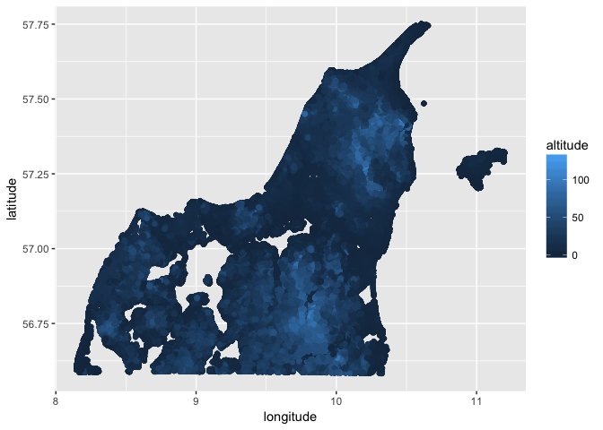

Scala Wrapper
================
João Antonio Ferreira
15 de janeiro de 2017

-   [R Markdown](#r-markdown)

R Markdown
----------

Este é um documento R Markdown. Markdown é um formato simples para gerar documentos HTML, DOCX e PDF.

Preparando o ambiente para rodar o KMeans da implementação R com o mesmo dataset da implementação Spark

``` r
options(max.print=50)
```

``` r
remove.packages(c("ggplot2", "data.table"))
install.packages('ggplot2', dep = TRUE)
install.packages('data.table', dep = TRUE)
```

Lendo o Dataset e investigando no grafico

``` r
myOriginalDataset <- read.delim('/data/prepared-3D_spatial_network.csv', header = TRUE, sep = ',') 
library(ggplot2)
```

    ## Warning: package 'ggplot2' was built under R version 3.3.2

``` r
altPlot <- qplot(longitude, latitude, data = myOriginalDataset, colour = altitude)
altPlot
```



Rodando o KMeans para k = 8

``` r
myDataset = as.matrix(cbind(myOriginalDataset$latitude, myOriginalDataset$longitude), ncol=2)
cl = kmeans(myDataset, 8)
cl_factor = factor(cl$cluster)
cl
```

    ## K-means clustering with 8 clusters of sizes 20260, 124742, 84382, 124996, 212194, 84618, 129876, 88690
    ## 
    ## Cluster means:
    ##       [,1]      [,2]
    ## 1 57.27896 11.015994
    ## 2 57.36944  9.838784
    ## 3 56.85540  8.902139
    ## 4 57.50719 10.422054
    ## 5 56.90282  9.948198
    ## 6 56.87210  8.499190
    ## 7 56.87579  9.409657
    ## 8 57.19721 10.234844
    ## 
    ## Clustering vector:
    ##  [1] 7 7 7 7 7 7 7 7 7 7 7 7 7 7 7 7 7 7 7 6 6 6 6 6 6 6 6 6 6 6 6 6 6 6 6
    ## [36] 6 6 6 6 6 6 6 6 6 6 6 6 6 6 6
    ##  [ reached getOption("max.print") -- omitted 869708 entries ]
    ## 
    ## Within cluster sum of squares by cluster:
    ## [1]  182.9947 5038.9028 3715.1888 3399.5340 8477.6286 3303.5523 6537.8912
    ## [8] 2374.7870
    ##  (between_SS / total_SS =  92.0 %)
    ## 
    ## Available components:
    ## 
    ## [1] "cluster"      "centers"      "totss"        "withinss"    
    ## [5] "tot.withinss" "betweenss"    "size"         "iter"        
    ## [9] "ifault"

Os 8 centroides encontrados.

``` r
# myDataset$cluster = cl_factor
centers = as.data.frame(cl$centers)
qplot(V2, V1, data = centers)
```


