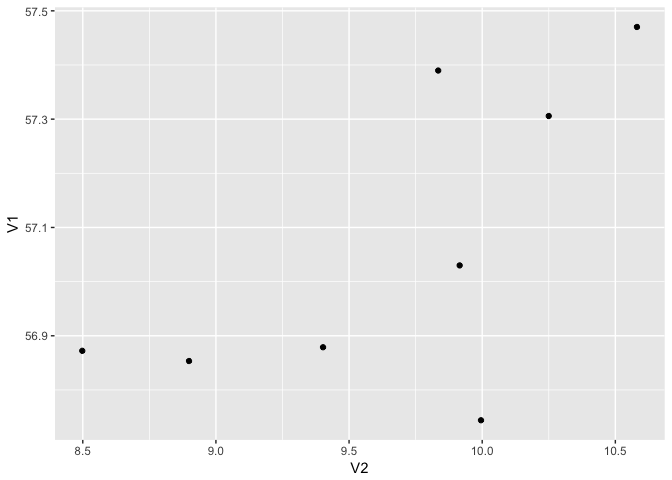

Scala Wrapper
================
João Antonio Ferreira
15 de janeiro de 2017

-   [R Markdown](#r-markdown)
-   [Gerando um Dataset no formato desejado](#gerando-um-dataset-no-formato-desejado)
-   [Preparação do ambiente R](#preparacao-do-ambiente-r)
    -   [Lendo o Dataset](#lendo-o-dataset)
    -   [Investigando no grafico](#investigando-no-grafico)
    -   [Rodando o KMeans para k = 8](#rodando-o-kmeans-para-k-8)
    -   [Código KMeans equivalente em Scala](#codigo-kmeans-equivalente-em-scala)

R Markdown
----------

Este é um documento R Markdown. Markdown é um formato simples para gerar documentos HTML, DOCX e PDF.

R Markdown é uma extensão para Markdown que acrescenta funcionalidade de execução de código R gerando saida Markdown que pode ser lida no Github.

Gerando um Dataset no formato desejado
--------------------------------------

Inicialmente configuro o Environment para usar o spark-shell

``` bash
export  SPARK_MASTER_IP=127.0.0.1
export  SPARK_LOCAL_IP=127.0.0.1
spark-shell
```

Partindo do dataset original vamos inserir 130.299 registros com pelo menos um atributo null e gerar mais registros usando operação map do Dataset do Spark. O Dataset original é 3D\_spatial\_network.csv

Fazendo os imports necessários.

``` scala
import collection.JavaConversions._
import java.io.File
import java.nio.file.Files
import java.nio.file.Paths
import java.util.Arrays
import org.apache.spark.ml.clustering.KMeans
import org.apache.spark.ml.feature.{VectorAssembler,StringIndexer,VectorIndexer,OneHotEncoder}
import org.apache.spark.ml.linalg.Vectors
import org.apache.spark.sql.Dataset
import org.apache.spark.sql.Encoder
import org.apache.spark.sql.Encoders
import org.apache.spark.sql.Row
import org.apache.spark.sql.SparkSession
import org.apache.spark.sql.types._
import org.apache.spark.sql.types.StructType
import spark.implicits._
```

``` scala
// utility function
def deleteRecursively(file: File): Unit = {
  if (file.isDirectory) {
    file.listFiles.foreach(deleteRecursively)
  }
  if (file.exists && !file.delete)
    throw new Exception(s"Unable to delete ${file.getAbsolutePath}")
}

val sparkSession = SparkSession.builder.
    appName("spark session example").
    getOrCreate()

val df = sparkSession.read.
          option("header","true").
          option("inferSchema","true").
          csv("3D_spatial_network.csv")

val sortedSet = df.sort("id", "latitude", "longitude", "altitude").collect()
// sortedSet é um Array[org.apache.spark.sql.Row]

val cachedDF = df.cache()

val fullRDD = sparkSession.sparkContext.parallelize(sortedSet)

val dfSchema = df.schema

// Criando classe para o Pattern ValueObject.
// No caso dos parametros puderem ser nulos usamos Option[Tipo]
case class RoadNet(id: Option[Integer], longitude: Option[Double],
                   latitude: Option[Double], altitude: Option[Double])

df.count()
// res2: Long = 434874

val fullDataframe = sparkSession.createDataFrame(fullRDD, dfSchema)
val Array(pf1, pf2) = fullDataframe.randomSplit(Array(0.70, 0.30))
pf2.count
// res3: Long = 130299

def returnDatasetWhichAllTuplesContainsOneAttributeNull(dsInput: Dataset[Row]) : Dataset[RoadNet] = {
  val allTuplesContainsNull = pf2.map(row => {
    val r = scala.util.Random
    val index = r.nextInt(4)
    def nullOneValue(i: Int): RoadNet = i match {
      case 0 => RoadNet(None,
          Option(row(1).asInstanceOf[Double]),
          Option(row(2).asInstanceOf[Double]),
          Option(row(3).asInstanceOf[Double])
      )
      case 1 => RoadNet(Option(row(0).asInstanceOf[Integer]),
          None,
          Option(row(2).asInstanceOf[Double]),
          Option(row(3).asInstanceOf[Double])
      )
      case 2 => RoadNet(Option(row(0).asInstanceOf[Integer]),
          Option(row(1).asInstanceOf[Double]),
          None,
          Option(row(3).asInstanceOf[Double])
      )
      case _ => RoadNet(Option(row(0).asInstanceOf[Integer]),
          Option(row(1).asInstanceOf[Double]),
          Option(row(2).asInstanceOf[Double]),
          None
      )
    }
    nullOneValue(index)
  })
  allTuplesContainsNull
  // allTuplesContainsNull: org.apache.spark.sql.Dataset[RoadNet] = [id: int, longitude: double, latitude: double, altitude: double]
}

val dataSetWhichAllTuplesContainsNull = returnDatasetWhichAllTuplesContainsOneAttributeNull(pf2)
dataSetWhichAllTuplesContainsNull.show
dataSetWhichAllTuplesContainsNull.count()
// Long = 130245

val dfSchema = df.schema

val myList: java.util.List[String] = Arrays.asList("hello", "world")
val namesColl: java.util.Collection[String] = myList.toSeq
sparkSession.sparkContext.parallelize(myList)

// Aumentando o tamanho da saida
def returnDatasetWhichRadomNoise(dsInput: Dataset[Row]) : Dataset[RoadNet] = {
  val datasetWithNoise = dsInput.map(row => {
    val r = scala.util.Random
    val index = r.nextInt(99)
    val signal: Int = if (index % 2 == 0) -1 else 1
    var noise = signal * index * 1E-15
    var drive = index % 3
    def addNoise(i: Int): RoadNet = i match {
      case 0 => RoadNet(
          Option(row(0).asInstanceOf[Integer]),
          Option(row(1).asInstanceOf[Double] + noise),
          Option(row(2).asInstanceOf[Double]),
          Option(row(3).asInstanceOf[Double])
      )
      case 1 => RoadNet(
          Option(row(0).asInstanceOf[Integer]),
          Option(row(1).asInstanceOf[Double]),
          Option(row(2).asInstanceOf[Double] + noise),
          Option(row(3).asInstanceOf[Double])
      )
      case 2 => RoadNet(
          Option(row(0).asInstanceOf[Integer]),
          Option(row(1).asInstanceOf[Double]),
          Option(row(2).asInstanceOf[Double]),
          Option(row(3).asInstanceOf[Double] + noise)
      )
    }
    val ret = addNoise(drive)
    ret
  })
  datasetWithNoise
}

val outputDir = "/data/large-output-coalesce"
if (Files.exists(Paths.get(outputDir))) {
  println("Diretório de saida já existe. Removendo diretório '" + outputDir + "'  ...")
  deleteRecursively(new File(outputDir))
}

val originalWithNoise = returnDatasetWhichRadomNoise(cachedDF)
val finalUnion = cachedDF.as[RoadNet].
    union(dataSetWhichAllTuplesContainsNull).
    union(originalWithNoise.as[RoadNet]) 

finalUnion.coalesce(1).write.format("com.databricks.spark.csv").
    option("header", "true").save(outputDir)
val recQty = finalUnion.count

println(s"Fazendo o Tidy de $recQty registros")
val prepared = finalUnion.na.drop()
val prepQty = prepared.count()
println(s"Sobraram $prepQty registros para o KMeans")

val outputDir = "/data/large-output-prepared"
if (Files.exists(Paths.get(outputDir))) {
  println("Diretório de saida já existe. Removendo diretório '" + outputDir + "'  ...")
  deleteRecursively(new File(outputDir))
}
prepared.coalesce(1).write.format("com.databricks.spark.csv").option("header", "true").save(outputDir)
val goodRecQty = prepared.count
```

Ao final renomeie o arquivo gerado para `/data/prepared-3D_spatial_network.csv`.

``` bash
mv /data/large-output-prepared/part*.csv /data/prepared-3D_spatial_network.csv
```

Preparação do ambiente R
------------------------

Preparando o ambiente para rodar o KMeans da implementação R com o mesmo dataset da implementação Spark

``` r
options(max.print=50)
```

``` r
remove.packages(c("ggplot2", "data.table"))
install.packages('ggplot2', dep = TRUE)
install.packages('data.table', dep = TRUE)
```

### Lendo o Dataset

``` r
myOriginalDataset <- read.delim('/data/prepared-3D_spatial_network.csv', header = TRUE, sep = ',') 
library(ggplot2)
```

    ## Warning: package 'ggplot2' was built under R version 3.3.2

### Investigando no grafico

``` r
altPlot <- qplot(longitude, latitude, data = myOriginalDataset, colour = altitude)
altPlot
```


### Rodando o KMeans para k = 8

``` r
myDataset = as.matrix(cbind(myOriginalDataset$latitude, myOriginalDataset$longitude), ncol=2)
cl = kmeans(myDataset, 8)
cl_factor = factor(cl$cluster)
cl
```

    ## K-means clustering with 8 clusters of sizes 84160, 89588, 115284, 84138, 110696, 149062, 109200, 127630
    ## 
    ## Cluster means:
    ##       [,1]      [,2]
    ## 1 56.85341  8.898971
    ## 2 56.74403  9.995484
    ## 3 57.30581 10.249920
    ## 4 56.87225  8.498051
    ## 5 57.47020 10.581183
    ## 6 57.02992  9.915375
    ## 7 57.38976  9.834739
    ## 8 56.87885  9.402266
    ## 
    ## Clustering vector:
    ##  [1] 8 8 8 8 8 8 8 8 8 8 8 8 8 8 8 8 8 8 8 4 4 4 4 4 4 4 4 4 4 4 4 4 4 4 4
    ## [36] 4 4 4 4 4 4 4 4 4 4 4 4 4 4 4
    ##  [ reached getOption("max.print") -- omitted 869708 entries ]
    ## 
    ## Within cluster sum of squares by cluster:
    ## [1] 3652.937 3346.971 4171.647 3278.523 7612.229 2446.854 4058.817 6297.011
    ##  (between_SS / total_SS =  91.6 %)
    ## 
    ## Available components:
    ## 
    ## [1] "cluster"      "centers"      "totss"        "withinss"    
    ## [5] "tot.withinss" "betweenss"    "size"         "iter"        
    ## [9] "ifault"

Os 8 centroides encontrados.

``` r
# myDataset$cluster = cl_factor
centers = as.data.frame(cl$centers)
qplot(V2, V1, data = centers)
```



### Código KMeans equivalente em Scala

``` scala
// Create a new VectorAssembler object called assembler for the feature
// columns as the input. Set the output column to be called features

val assembler = new VectorAssembler().
      setInputCols(Array("latitude", "longitude")).
      setOutputCol("features")

// Use the assembler object to transform the feature_data
// Call this new data training_data
val training_data = assembler.transform(prepared).select("features")
training_data.schema

val inicio = new java.util.Date()

val kmeans = new KMeans().setK(8).setSeed(314L).setMaxIter(30)

// Fit that model to the training_data
// O processo de fit demora mais de dois minutos para 900.000 registros.
val model = kmeans.fit(training_data)
println("Duração: " + new java.util.Date() + " - " + inicio)

// Evaluate clustering by computing Within Set Sum of Squared Errors.
val WSSSE = model.computeCost(training_data)
println(s"Within Set Sum of Squared Errors = $WSSSE")

// Shows the result.
println("Cluster Centers: ")
import scala.math.Ordering
// model.clusterCenters.sorted(Ordering[Double]).foreach(println)
val clustersId = model.summary.predictions.select(s"prediction").distinct().sort("prediction")
clustersId.show
val predictions = model.summary.predictions.sort("prediction")
predictions.show
model.clusterCenters.foreach(println)
// Falta determinar quais centros são de quais clusters para correlacionar os centros com as predictions
```
